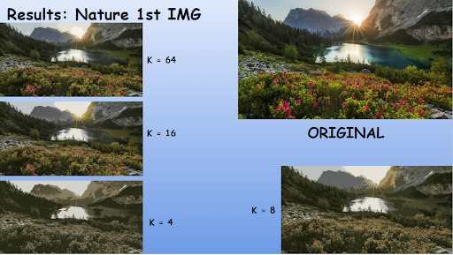

# Image Compression Using K-Means Clustering

Authors:
Kush Momaya, Jeric Pascua, Sarah Armstrong, Pysey Ung, Eli Line-Im

## Project Proposal - Image Compression

Our team project group proposal is about the compression of images through the K-means Clustering algorithm. K-means clustering is an algorithm in which objects are classified into different classes based on some sort of distance measure that is calculated between the objects. The clusters are then optimized through the reduction of their number or the change in their center. Image compression is the process of reducing the amount of space that an image takes through the reduction of unique colors. Additionally, the image must remain at a reasonable quality throughout the compression. We would like to explore the effectiveness of K-means Clustering across three different types of categories of images such as animals, buildings, and human faces. We would decide a number of clusters for each image and reduce that number until we see a significant decrease in the quality of the image. To optimize the number of clusters we would use the elbow method, where we plot the number of clusters, compared with a measure of variance to see which k would have the least impact on the reduction of quality. We would do this by using a for loop to calculate the SSE for a range of k-values for each image, and plotting the k-value and its related SSE. We would then compare the optimal k-value with what image appears to keep the important characteristics of the image. Furthermore, for each category, we would like to explore different images and discover the impact that changing the value of k has on each photo. From this, we can take the mean of k from each category, and compare the average k across all three categories. Our initial look at our data would be vectorizing the images and comparing their RGB values to see what kind of variance exists in the values for each image. We can then look at what this tells us about the k-values, both within categories and between categories. 

#### **Dataset:** https://drive.google.com/drive/folders/15OMJmn_gXL473LKGaDbD9ssrF8-GhgeA?usp=sharing

##### Also located in original_images folder

## Contributions:

Kush Momaya: Used the K-means algorithm to compress and analyze 2 building images, constructed elbow graphs for each, performed EDA by vectorizing every image and plotting their respective bar charts. Performed data cleaning and preprocessing for the data by creating dataframes for each image to create visualizations. This involved analysis of color patterns when looking at EDA graphs and construction of initial hypotheses regarding the effects of image compression.

Pysey Ung: Conducted K-means image compression on human face and building images, constructed elbow graphs for each, and analyzed the results of the different k-values and optimal cluster size. Retrieved images to add to the dataset.

Sarah Armstrong: Used K-means clustering on human face images along with their respective elbow graphs and analyses, retrieved images to add to the dataset

Jeric Pascua: K-Means image compression on nature and building images, exploratory data analysis using elbow graphs, and visual analysis comparing the results of each K-value effect on the original images, retrieved images to add to the dataset

Eli Line-Im: Ran K mean algorithm on two nature images along with creating an elbow graph for each of the two nature images, as well as conducting their respective analysis. Retrieved images to add to the dataset.

## Techniques
We are using pandas and numpy for parts of our EDA and generating our elbow graphs so we can visualize our results and perform various calculations. Matplotlib helps with visualizing the data as well. The skimage library is what allows us to import and use the image in tandem with the sklearn library from which we import the k-means clustering algorithm. Finally we use the cv2 library to import images and vectorize them alongside pandas for the EDA part.

## Data Collection & Cleaning
We read in the images through the use of CV2 (computer vision) library, and then vectorize the pixels into RGB columns and create dataframes for each image. 

## EDA
For our explatory data analysis we take the dataframes we made for each image and calculate the median for each RGB column. We then plot them against each other to compare the variance in the color pixel values. We are looking to see if there is a relation between the variance in pixel color values and the optimal k-value observed, both between the different categories and within the individual images. These bar charts help us visualize which images have significant variances and which ones seem to have an uniform distribution.

## K-Means Clustering Algorithm
This is where we conduct our analysis by running the k-means clustering algorithm on each image. We did this by reading in the image, reshaping them to fit into the algorithm, and then running it. We call the algorithm with the desired number of iterations and the k-value, fitting it to the image, and then recluster it with a new center and compress them.

After running the K-mean Algorithm on the first nature image, we can see that the best max K value was 64 because the compressed image is extremely identical to the original image. However, the compressed image is still acceptable at k = 16 because the compressed image still has equal variability in color as the original image. Yet, this does not hold true for k = 8 because we can see that the variability in color is no longer the same as the flowers no longer have a reddish pinkish color. Furthermore, as k gets smaller which can be seen at k = 4, the image is no acceptable in terms of the color when comparing itself to the original image because when k does equal 4 like in one of the compressed images above, there seems to be no difference in colors between the types of flowers, and along with the sun and mountains. Even though this is the case, the image is still acceptable at k = 4 because even though there is a loss of color contrast between the details, the shapes and the placements of the objects within the image do not differ from the original image. Thus, the smallest value k can be to output an acceptable compressed image is 4.

After visualizing the clusters across the SSE for the first nature image, we can see that by the Elbow Method the best acceptable number of clusters for k is 3. The number of clusters determined by the the K-mean algorithm method was higher than the number of clusters determined by the elbow method by 1. Thus, the number of clusters determined to be acceptable by both method are very similar.

###### The analysis for the rest of the images are located inside of the Jupyter notebook file

## Conclusion

Now that we have all of the results of the compressions we can calculate the optimal k for each category by finding the mean of the images within them. For the nature images we find that the algorithm provided an optimal mean of 4, for the buildings it said 3.75 and for the human faces it said 3.3334. Looking at the categories separately we notice that the nature image values seem to contain a larger variety of colors when compared to the other categories which is what can contribute to the increased mean when. Examining the bar charts we made during our EDA process, we see that in every chart for the nature images, there is a clear variance in the RGB values which we said would be a predicting value for the optimal number of clusters given by the elbow graphs. Looking at the bar charts for the building images we see a smaller amount of variance when compared to the nature images, but there still exists some variance in all but the white building. This is again correlated with the higher mean optimal number of clusters when compared to the human faces category. That category had the least amount of variance in the initial RGB bar charts, and this was reflected by it having the lowest mean number of clusters, by a larger margin than the difference between the nature and building images, which places an emphasis on the uniformity of the colors and its relationship with the number of optimal clusters found by the k-means algorithm. Looking at the individual images we found that for the more colorful images, although the algorithm suggested a smaller k value for the best compression, we preferred a larger k-value so that the colors were preserved. At k-values like four, the overall shape of the images was kept and the significant parts of the images were still distinct, but a large portion of the color detail was absent. For the human faces and building photos this was not as much of a problem, but for the nature photos they began to appear as desaturated blobs and since there were large clumps of colors, they lost a large portion of the detail required to distinguish certain parts of the image. From this we can conclude that as we saw a larger variety in the colors of the image, both we and the algorithm preferred a larger k-value, with our eyes preferring significant increases and the algorithm preferring more minor increases in the number of clusters.